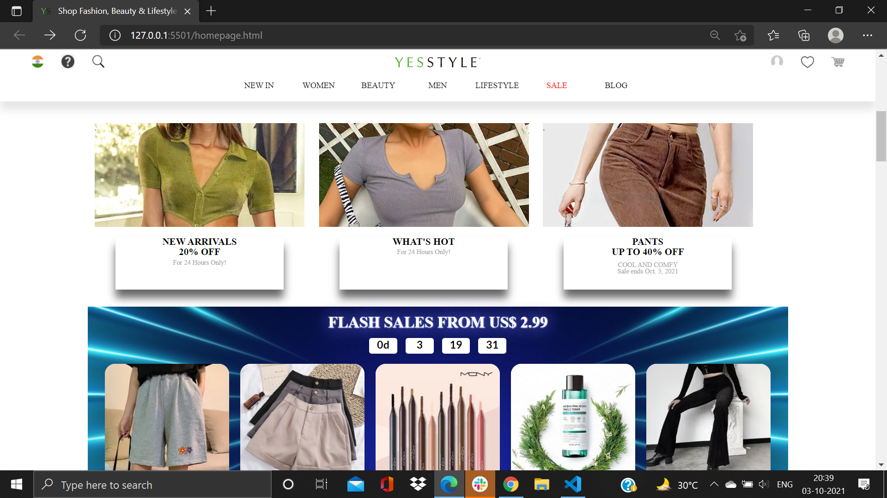

# Yes Style Clone

This project is a part of our build week in coding bootcamp name ***masai school*** so, basically as a part of build week which happens after each one month of the journey we collaborate in a team of 5-6 people and work on making a clone of a specific website .

</img>

## Page Details

#### SIGN IN PAGE

 *
In this page we have used transition and we have integrated signin and login functionality in one window.
*

#### LANDING PAGE

*
This is the landing page where user will visit they'll be having an amazing user-experience with amazing **UI** and user friendly experience.
*

#### DROPDOWN BOX

*
This is the extension of building amazing ui components in the homepage, this dropdown box is completely created using raw Html & Css.
*

#### PRODUCT DISPLAY PAGE

*
In this page we're showing the product we're going to buy, user will be able to see the details of the product and add it to their cart.
*

#### CART PAGE

*
This page is created wholly dynamic and we can change anything at any time as we want. Once we have added atleast one product in the cart a checkout box will popup for further payment process.
*

#### CHECKOUT PAGE

*
Here the user will be able to apply discount coupon and vouchers for only one time and see the final price.
*

#### PAYMENT PAGE

*
We have two payment methods-* 
**1 - Card Payment** 
**2 - Cash On Delievery**

And, once when user enters the details it will show payment successful

<h4>Individual Project with personal changes</h4>

<h5>Jatin Sharma</h5>

[github](https://github.com/jatinsharma9871)

<h5>Jatin Sharma</h5>
